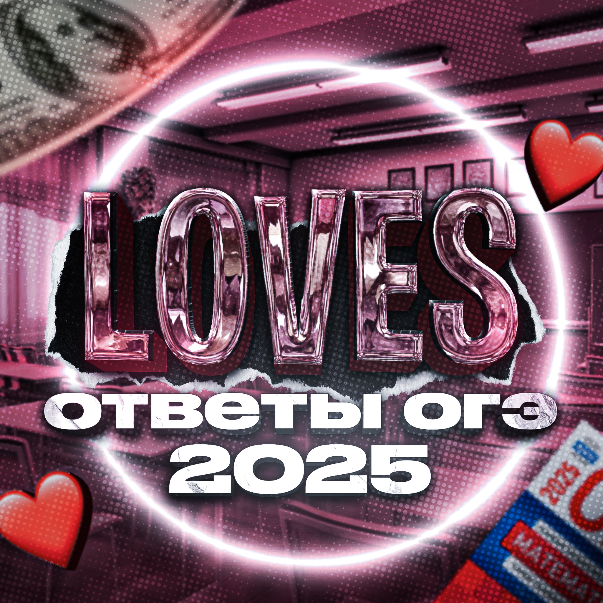

<html lang="ru">
<head>
    <meta charset="UTF-8">
    <meta name="viewport" content="width=device-width, initial-scale=1.0">
    <title>Loves - Ответы ОГЭ</title>
    
</head>
<body>
    

        

            
            

        

        
Loves ❤

        
Ответы ОГЭ 2025

        <a href="https://t.me/otveti_loves" class="button">Открыть в Telegram</a>
    

</body>
</html>
